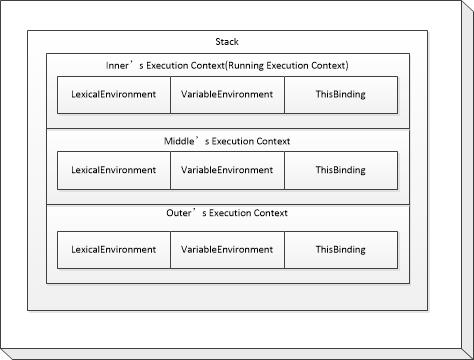

## function的执行之执行上下文([Execution Contexts](http://es5.github.io/#x10.3))
这一章描述了一个Execution Context的栈结构<br/>

每次函数调用会创建一个Execution Context（入栈），每个返回语句或throw会将Execution Context出栈。 
上图描述了下方代码运行到`console.log...`时的Execution Context的情况。
```javascript
function outer(outerArg){
    function middle(midArg){
        function inner(innerArg){
            console.log(outerArg,midArg,innerArg);
        }
        inner('innerArg');
    }
    middle('midArg');
}
outer('outerArg');
```
根据[Execution Contexts](http://es5.github.io/#x10.3)文章描述，当Execution Context在创建时，LexicalEnvironment和VariableEnvironment一开始有相同的值，LexicalEnvironment在代码运行中可能会改变，而VariableEnvironment一直不变。
目前还不知道这句话有什么用，可能以后会用到。

当`console.log(outerArg,midArg,innerArg)`执行的时候，是如何获取到`outerArg`，`midArg`，`innerArg`的呢？
想必不是在LexicalEnvironment中获取就是在VariableEnvironment中获取，具体在哪个目前还不知道。
Lexical Environment中的[Environment Records](http://es5.github.io/#x10.2.1)
就是一个存储区域，但是目前为止还不知道这个区域的变量是如何
初始化进去的。接着往下看。

[下一节](function-DeclarationBindingInstantiation.md)
