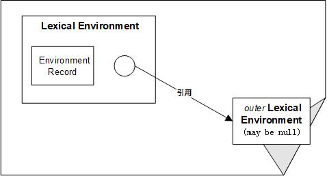
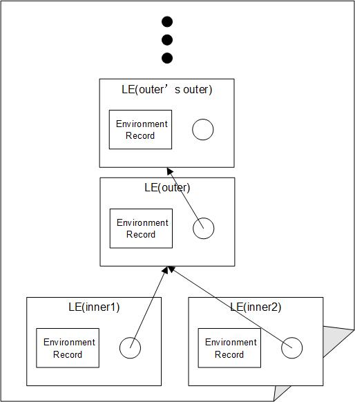

## function的执行之Lexical Environment

### [Lexical Environment](http://es5.github.io/#x10.2)&[Environment Record](http://es5.github.io/#x10.2.1)

"Define the association of Identifiers to specific variables and functions."
（定义Identifiers与某个变量、函数的关系）

 

```javascript
function outer(){
    function inner1(){}
    function inner2(){}
    inner1();
    inner2();
}
outer()
```
 

[ECMA-262-5.1](http://es5.github.io/)<br/>
[10.2.2.1](http://es5.github.io/#x10.2.2.1) GetIdentifierReference (lex, name, strict)
The abstract operation GetIdentifierReference is called with a Lexical Environment lex, an identifier String
name, and a Boolean flag strict. The value of lex may be null. When called, the following steps are performed:
1. If lex is the value `null`, then<br/>
    a. Return a value of type Reference whose base value is undefined, whose referenced name is name,
and whose strict mode flag is strict.
2. Let envRec be lex‘s environment record.
3. Let exists be the result of calling the HasBinding(N) concrete method of envRec passing name as the
argument N.
4. If exists is `true`, then<br/>
    a. Return a value of type Reference whose base value is envRec, whose referenced name is name, and
whose strict mode flag is strict.
5. Else<br/>
    a. Let outer be the value of lex’s outer environment reference.<br/>
    b. Return the result of calling **GetIdentifierReference passing outer, name, and strict as arguments**.

以上就是说 **递归地** 在Lexical Environment中找identifier的引用(reference)<br/>
代码例子：
```javascript
function outer(outerArg){
    function middle(midArg){
        function inner(innerArg){
            console.log(outerArg,midArg,innerArg);
        }
        inner('innerArg');
    }
    middle('midArg');
}
outer('outerArg');
```

[下一节](function-ExecutionContext.md)
