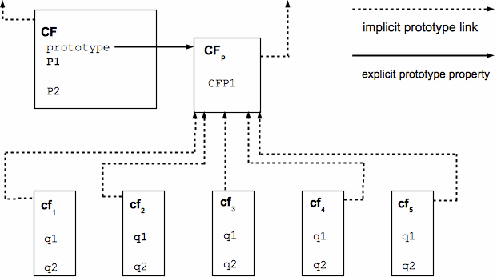

# 面向对象之prototype & \_\_proto__
[prototype的介绍](https://es5.github.io/#x4.2.1)

    "Each constructor is a function that has a property named “prototype” that is used to implement prototype-based inheritance and shared properties."
这constructor指的是一个function，比如`function Animal(){}`,当`new Animal()`时，`Animal`就是一个构造器constructor.它的prototype属性就是用来实现继承和共享属性的，
共享属性(父类属性被子类共享)，如果再加上一个“就近原则”,就实现了“重写”.


上图是规范中的一张图，cf1~cf2都是CF类的实例，实例能共享原型中的属性,但CF是不能共享CFp的属性的，
即cf1.CFP1能取到值，而CF.CFP1是没有这个属性的，是undefined.也就是说，原型链共享变量是与实例共享，与构造器不共享。

    "All objects have an internal property called [[Prototype]]. The value of this property is either null or an object
     and is used for implementing inheritance. Whether or not a native object can have a host object as its
     [[Prototype]] depends on the implementation. Every [[Prototype]] chain must have finite length (that is, starting
     from any object, recursively accessing the [[Prototype]] internal property must eventually lead to a null value)."
以上描述了一个“原型链”的结构，有限长且以null结尾。

a.\_\_proto__.\_\_proto__.\_\_proto__ ...
这就是一个原型链，a.\_\_proto__代表的就是a实例的原型，与构造器A的prototype属性相等(`===`为`true`)。<br/>
**继承实际就是原型的拼接**

现在说一下所有的对象(包括函数)是如何实现继承Object类的:
1. `var a = new Object()`,a的构造器是
`Object`(是function),a的`__proto__`就是**对象**(此处使用“对象”区别于Object，Object是
构造器，也就是一个function，而“对象”在这里指的是[ECMAScript的内置对象](https://es5.github.io/#x15.2))的原型，
也是`Object.prototype`.以上说明，`Object.prototype`就是对象的原型，对象指的是ECMAScript的内置对象，
`Object`是对象的构造器。
2. 现在声明一个类`function Animal(){}`,Animal.prototype是什么，
看[Creating Function Objects](https://es5.github.io/#x13.2)，Animal.prototype的值被设置成`new Object()`,
那么，`var a = new Animal()`,a的原型是`new Object()`,`new Object()`的原型是对象的原型，
则a的原型的原型就是对象的原型，即`a.__proto__.__proto__===Object.prototype//true`.
总结一下，`Animal.prototype=new Object()`这个操作，导致了对象实例的原型链接在了Animal实例的原型后边。
在此我们可以得一个结论，**将constructorA的prototype指向new constructorB()，就能实现A类实例的原型接上B类实例的原型链。**
**我们通过操作constructor.prototype属性指向，就能实现继承。**
**简单理解就是：继承就是把原型链接上。**
3. 在《js高级程序设计》里有讲了各种继承的实现，把各种继承的缺点我们都弥补之后，我们就能得到一个完美的继承实现。
我们现在看一个zrender里一个“完美继承”的实现(先不用看注释，下边的解释会提到)。
```javascript
function inherits(clazz, baseClazz) {
    var clazzPrototype = clazz.prototype;
	//start 定义F的目的就是剥离baseClazz构造函数可能给baseClazz实例增加的属性。将子类的原型指向没有初始化任何属性的父类实例。
    function F() {}
    F.prototype = baseClazz.prototype;
    clazz.prototype = new F();
	//end
	//新的子类原型将原有的原型属性再加回来。
    for (var prop in clazzPrototype) {
        clazz.prototype[prop] = clazzPrototype[prop];
    }
	//构造函数再指回来。
    clazz.prototype.constructor = clazz;
	//加一个超类标记。这个不重要。
    clazz.superClass = baseClazz;
}
```
要让clazz继承baseClazz,那么必定要让clazz.prototype指向`new baseClazz()`，假如baseClazz实例
有一个name属性(通过构造器设置)，那么clazz的所有实例都有这个name属性，这是不应该的，子类应该能获取父类
的属性，而不是父类实例的属性。实际上我们只需让clazz.prototype指向**原型是baseClazz.prototype的对象**就行，
因此上边代码搞了一个`function F(){}`，F的实例的原型是baseClass.prototype,且不包含其他属性。
`clazz.prototype = new F()`就把父类的原型链接到了子类上(不准确但容易理解)。
然后把暂存的子类自己的原型(clazz.prototype)的属性再加回去(for in语句部分)。
`clazz.prototype.constructor = clazz`,构造器还要再指回来(`clazz.prototype = new F()`
这句，使clazz.prototype对象没有constructor属性)。
为什么要`constructor.prototype.constructor = constructor`这个我目前也不知道准确答案，
给个链接[Why is it necessary to set the prototype constructor?](https://stackoverflow.com/questions/8453887/why-is-it-necessary-to-set-the-prototype-constructor/35538702#35538702)

原型可以理解为模子，有了模子，就能搞出模子定义的东西，如果模子定义了另一个模子，由模子则可以生产模子。
js里由两个基本的模子，对象的原型和函数的原型。由对象的原型，可以派生出各种对象，原型对象也是对象；由
函数原型，可以派生出构造器，各种构造器可以创建任何实例。

结束。
